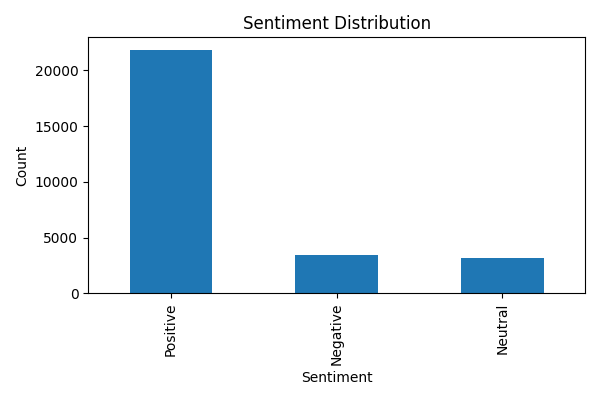

# 🎬 Real-Time IMDb Data Pipeline & Sentiment Analysis

> Hệ thống Data Engineering end-to-end dùng để thu thập dữ liệu phim IMDb, xử lý dữ liệu theo luồng, phân tích cảm xúc bình luận, lưu kết quả vào PostgreSQL và trực quan hóa bằng Grafana, Power BI và Flask.

<p align="center">
  
</p>

---

## 1. Tổng quan dự án

Dự án mô phỏng một nền tảng xử lý dữ liệu IMDb gần thời gian thực với nhiều thành phần trong hệ sinh thái Big Data:

- Thu thập dữ liệu phim, diễn viên, đạo diễn và bình luận từ IMDb bằng **Selenium + Python**.
- Tiếp nhận dữ liệu từ **JSON**, **MongoDB** hoặc **Kafka** thông qua **Apache NiFi**.
- Lưu dữ liệu thô vào **Hadoop HDFS**.
- Đọc và xử lý dữ liệu bằng **Apache Spark Structured Streaming**.
- Tính toán các chỉ số phân tích phim, doanh thu, đạo diễn, đánh giá và cảm xúc người dùng.
- Huấn luyện hoặc tải mô hình NLP gồm **Tokenizer → StopWordsRemover → CountVectorizer → IDF → Logistic Regression**.
- Ghi kết quả phân tích liên tục vào **PostgreSQL** bằng JDBC.
- Điều phối pipeline bằng **Apache Airflow**.
- Thu thập metric bằng **Prometheus** và hiển thị trên **Grafana**.
- Trực quan hóa báo cáo bằng **Power BI** và ứng dụng **Flask**.

Dự án phù hợp cho mục đích học tập, portfolio Data Engineer, minh họa kiến trúc streaming và xây dựng hệ thống phân tích dữ liệu end-to-end.

---

## 2. Mục tiêu chính

Hệ thống hướng tới các mục tiêu sau:

1. Xây dựng luồng thu thập dữ liệu IMDb tự động.
2. Tách dữ liệu thành ba nhóm chính: `movie`, `actor`, `review`.
3. Đưa dữ liệu qua Kafka/NiFi và lưu vào HDFS.
4. Xử lý dữ liệu liên tục bằng Spark Structured Streaming.
5. Làm sạch dữ liệu số như doanh thu, ngân sách, lượt thích, lượt không thích và số lượt bình chọn.
6. Phân tích xu hướng đánh giá, doanh thu, lợi nhuận và đạo diễn.
7. Phân loại cảm xúc bình luận thành Positive, Neutral và Negative.
8. Lưu kết quả vào PostgreSQL để truy vấn và xây dựng dashboard.
9. Theo dõi trạng thái hệ thống bằng Prometheus và Grafana.
10. Tự động hóa quy trình bằng Airflow DAG.

---

## 3. Kiến trúc hệ thống

### 3.1 Luồng dữ liệu tổng quát

```text
IMDb Website
    │
    ├── Selenium + Python crawler
    │          │
    │          └── Kafka producer / JSON files
    │
JSON files ───────┐
MongoDB ──────────┼──> Apache NiFi ───> Hadoop HDFS
Kafka ────────────┘                         │
                                           ▼
                               Spark Structured Streaming
                                           │
                     ┌─────────────────────┼──────────────────────┐
                     │                     │                      │
                Data Cleaning          Analytics            NLP Model
                     │                     │                      │
                     └─────────────────────┴──────────────────────┘
                                           │
                                           ▼
                                      PostgreSQL
                                           │
                       ┌───────────────────┼───────────────────┐
                       │                   │                   │
                    Power BI          Flask Web           Grafana

Airflow: điều phối các bước của pipeline
Prometheus: thu thập metric từ NiFi, Kafka, HDFS, Spark, PostgreSQL và Airflow
```

### 3.2 Vai trò của từng thành phần

| Thành phần | Vai trò |
|---|---|
| IMDb | Nguồn dữ liệu phim và bình luận |
| Selenium + BeautifulSoup | Thu thập dữ liệu động từ website |
| JSON | Nguồn dữ liệu mẫu và phương án chạy offline |
| MongoDB | Nguồn NoSQL tùy chọn cho NiFi |
| Kafka | Hàng đợi sự kiện và truyền dữ liệu theo luồng |
| Apache NiFi | Ingestion, routing, validation và ghi dữ liệu vào HDFS |
| Hadoop HDFS | Data lake lưu dữ liệu thô phân tán |
| Spark Structured Streaming | Làm sạch, join, aggregate và xử lý streaming |
| Spark MLlib | Tiền xử lý văn bản và phân loại cảm xúc |
| PostgreSQL | Lưu bảng kết quả phân tích |
| Airflow | Điều phối và giám sát workflow |
| Prometheus | Thu thập metric |
| Grafana | Dashboard vận hành hệ thống |
| Flask | Giao diện dự đoán cảm xúc và xem biểu đồ |
| Power BI | Dashboard phân tích nghiệp vụ |

---

## 4. Luồng xử lý chi tiết

### Bước 1 — Thu thập dữ liệu

File `kafka/crawl_data.py` sử dụng Selenium, BeautifulSoup và Chrome headless để lấy:

- Thông tin phim.
- Điểm IMDb.
- Năm phát hành.
- Số lượt bình chọn.
- Thời lượng.
- Quốc gia, ngôn ngữ và hãng sản xuất.
- Ngân sách và doanh thu.
- Đạo diễn, biên kịch và diễn viên.
- Bình luận, điểm sao, lượt thích và lượt không thích.

Crawler có sử dụng Kafka Producer. Trong một số đoạn code, dữ liệu được lưu vào bảng outbox trước khi gửi Kafka để hỗ trợ retry và theo dõi trạng thái gửi.

### Bước 2 — Ingestion bằng NiFi

Template `nifi/IMDB_nifi.xml` chứa flow để:

- Đọc dữ liệu từ JSON.
- Đọc dữ liệu từ MongoDB.
- Nhận dữ liệu từ Kafka.
- Route dữ liệu theo loại bản ghi.
- Ghi dữ liệu vào HDFS.
- Xuất metric để Prometheus thu thập.

### Bước 3 — Lưu dữ liệu thô trên HDFS

Spark hiện được cấu hình đọc ba thư mục:

```text
/IMDB/movie
/IMDB/actor
/IMDB/review
```

Mỗi thư mục chứa dữ liệu JSON Lines tương ứng.

### Bước 4 — Làm sạch dữ liệu

Module `spark/clean_data.py` thực hiện:

- Loại bỏ bản ghi lỗi.
- Chuẩn hóa `revenue` và `budget` thành số nguyên.
- Chuẩn hóa `vote_count` có hậu tố `K` hoặc `M`.
- Chuẩn hóa `like` và `dislike`.
- Chuyển `star` sang kiểu số.
- Làm sạch chuỗi danh sách `writers` và `stars`.
- Loại bỏ một số cột không cần thiết.

### Bước 5 — Phân tích bằng Spark

Module `spark/analysis.py` thực hiện các nhóm phân tích:

1. Thống kê rating, doanh thu, ngân sách và lợi nhuận theo quốc gia/ngôn ngữ.
2. Phân tích tương tác người dùng theo phim.
3. Xếp hạng đạo diễn theo rating và doanh thu.
4. Phân tích xu hướng đánh giá theo năm.
5. Tổng hợp cảm xúc Positive/Neutral/Negative theo phim.
6. Sinh biểu đồ khám phá dữ liệu.
7. Huấn luyện pipeline phân loại cảm xúc bằng Spark MLlib.
8. Khai phá luật kết hợp bằng FP-Growth.

### Bước 6 — Ghi PostgreSQL

Module `spark/orchestration.py` sử dụng `foreachBatch()` để ghi từng micro-batch vào PostgreSQL thông qua JDBC.

### Bước 7 — Trực quan hóa

- **Flask**: nhập bình luận và nhận dự đoán cảm xúc.
- **Power BI**: đọc dữ liệu PostgreSQL và hiển thị báo cáo nghiệp vụ.
- **Grafana**: hiển thị metric vận hành từ Prometheus.

---

## 5. Cấu trúc thư mục

```text
Realtime-IMDB-Sentiment-Analysis-main/
├── README.md
├── imdb_flow.png
├── postgresql-42.7.3.jar
├── .gitignore
│
├── docs/
│   └── images/
│       └── realtime-imdb-architecture.png
│
├── data/
│   ├── movies.json
│   ├── actors.json
│   └── reviews.json
│
├── kafka/
│   ├── crawl_data.py
│   ├── push_kafka.py
│   └── crawl_data_test.ipynb
│
├── nifi/
│   ├── IMDB_nifi.xml
│   └── spec_data/
│       ├── spec_movie.json
│       ├── spec_actor.json
│       └── spec_review.json
│
├── spark/
│   ├── configuration.py
│   ├── load_data.py
│   ├── clean_data.py
│   ├── analysis.py
│   ├── orchestration.py
│   ├── main.py
│   └── spark_test.ipynb
│
├── models/
│   └── tf_idf_model/
│       ├── metadata/
│       └── stages/
│
├── check_points/
│   ├── top_country/
│   ├── top_director_rate/
│   ├── top_sentiment/
│   ├── rating_per_year/
│   └── top_user_sentiment/
│
├── dags/
│   ├── airflow_kafka.py
│   └── airflow_spark_psql.py
│
├── monitoring/
│   ├── prometheus.yml
│   ├── config/
│   └── grafana/
│
├── dashboard/
│   └── IMDB_Dashboard.pbix
│
└── web/
    ├── web.py
    ├── templates/
    │   ├── index.html
    │   ├── charts.html
    │   └── about.html
    └── static/
        ├── sentiment_distribution.png
        ├── star_distribution.png
        ├── correlation_heatmap.png
        ├── wordcloud.png
        └── ...
```

---

## 6. Dữ liệu đầu vào

### 6.1 Movie schema

Ví dụ:

```json
{
  "movie_id": "tt0111161",
  "title": "The Shawshank Redemption",
  "rating": 9.3,
  "year": 1994,
  "vote_count": "3.1M",
  "runtime": "2h 22m",
  "items": "R",
  "country": "United States",
  "language": "English",
  "company": "Castle Rock Entertainment",
  "budget": "$25,000,000 (estimated)",
  "revenue": "$28,767,189",
  "plot": "...",
  "poster": "https://...",
  "url": "https://www.imdb.com/title/tt0111161/"
}
```

### 6.2 Actor schema

```json
{
  "actor_id": "A002",
  "director": "Frank Darabont",
  "writers": ["Stephen King", "Frank Darabont"],
  "stars": ["Tim Robbins", "Morgan Freeman", "Bob Gunton"],
  "movie_id": "tt0111161"
}
```

### 6.3 Review schema

```json
{
  "review_id": "R001",
  "title_review": "An incredible movie",
  "comment": "It is quite literally breathtaking...",
  "star": "10",
  "like": "516",
  "dislike": "45",
  "date": 1613520000000,
  "user_name": "example_user",
  "movie_id": "tt0111161"
}
```

---

## 7. Kết quả phân tích

### 7.1 `top_country`

Thống kê theo quốc gia và ngôn ngữ:

- Rating trung bình.
- Tổng doanh thu.
- Tổng số phim.
- Tổng ngân sách.
- Lợi nhuận trung bình.

### 7.2 `top_user_sentiment`

Thống kê tương tác theo phim:

- Tổng số review.
- Tổng lượt thích.
- Tổng lượt không thích.
- Tỷ lệ thích.

### 7.3 `top_director_rate`

Thống kê đạo diễn:

- Rating trung bình.
- Tổng số phim.
- Tổng doanh thu.

### 7.4 `rating_per_year`

Thống kê theo năm:

- Rating trung bình.
- Số lượng phim.
- Số lượng review.

### 7.5 `top_sentiment`

Thống kê cảm xúc theo phim:

- Tổng review.
- Số review Positive.
- Số review Neutral.
- Số review Negative.

---

## 8. Quy tắc gán nhãn cảm xúc

Trong code phân tích, cảm xúc được gán từ số sao:

| Điểm sao | Nhãn |
|---:|---|
| `8–10` | Positive |
| `5–7` | Neutral |
| `< 5` | Negative |

Pipeline ML hiện có các stage:

```text
Tokenizer
  → StopWordsRemover
  → CountVectorizer
  → IDF
  → LogisticRegression
```

Model trong `models/tf_idf_model` được lưu dưới định dạng Spark `PipelineModel` và metadata cho thấy model được tạo bằng Spark `4.0.1`.

> Repository chưa kèm báo cáo đánh giá đầy đủ như accuracy, precision, recall, F1-score hoặc confusion matrix. Khi sử dụng model cho báo cáo chính thức, nên chạy lại quá trình đánh giá trên tập test và công bố metric thực tế.

---

## 9. Biểu đồ khám phá dữ liệu

Dự án đã có các biểu đồ trong `web/static/`:

- Phân phối điểm sao.
- Phân phối cảm xúc.
- Tương quan lượt thích và không thích.
- Boxplot lượt thích theo cảm xúc.
- Word cloud bình luận.
- Correlation heatmap.
- Association rules theo confidence.
- Support so với confidence.
- Lift so với confidence.

<p align="center">
  
  
</p>

---

## 10. Yêu cầu môi trường

### Phần mềm chính

- Linux hoặc WSL2 được khuyến nghị.
- Python 3.10 hoặc 3.11.
- Java phù hợp với phiên bản Spark/Hadoop đang sử dụng.
- Apache Spark.
- Apache Hadoop HDFS.
- Apache Kafka.
- Apache NiFi.
- PostgreSQL.
- Apache Airflow.
- Prometheus.
- Grafana.
- MongoDB nếu sử dụng nguồn MongoDB.
- Google Chrome/Chromium và ChromeDriver nếu chạy crawler.
- Power BI Desktop nếu mở file `.pbix`.

### Thư viện Python

Tạo môi trường ảo:

```bash
python3 -m venv .venv
source .venv/bin/activate
python -m pip install --upgrade pip
```

Cài các thư viện ứng dụng:

```bash
pip install \
  pandas \
  selenium \
  selenium-stealth \
  beautifulsoup4 \
  tqdm \
  confluent-kafka \
  psycopg2-binary \
  hdfs \
  pyspark \
  matplotlib \
  seaborn \
  wordcloud \
  flask
```

Cài thư viện Airflow trong môi trường riêng để tránh xung đột dependency:

```bash
python3 -m venv .airflow-venv
source .airflow-venv/bin/activate
python -m pip install --upgrade pip
pip install apache-airflow apache-airflow-providers-standard apache-airflow-providers-smtp
```

> Nên cài Airflow theo constraints file tương ứng với phiên bản Airflow và Python của máy bạn.

---

## 11. Cấu hình bắt buộc trước khi chạy

Repository hiện chứa nhiều đường dẫn, địa chỉ IP và thông tin kết nối được ghi trực tiếp trong code. Cần thay đổi trước khi chạy trên máy khác.

### 11.1 PostgreSQL

Các file cần kiểm tra:

```text
kafka/crawl_data.py
spark/orchestration.py
```

Thông tin cần thay:

```text
host
port
database
username
password
```

Khuyến nghị chuyển sang biến môi trường:

```bash
export POSTGRES_HOST=localhost
export POSTGRES_PORT=5432
export POSTGRES_DB=imdb_sentiment
export POSTGRES_USER=postgres
export POSTGRES_PASSWORD='your_secure_password'
```

### 11.2 Đường dẫn dự án

Các file đang dùng đường dẫn tuyệt đối như:

```text
/home/enovo/prj/test/...
/home/enovo/prj/EXAM_DATA/Week5 + Week6/...
/home/mhai/Project DE/EXAM_DATA/Week5 + Week6/...
```

Cần thay bằng đường dẫn thực tế của project trên máy bạn.

Ví dụ:

```bash
export PROJECT_ROOT="$HOME/projects/Realtime-IMDB-Sentiment-Analysis-main"
```

### 11.3 HDFS path

Hiện có hai convention khác nhau trong repository:

```text
Spark đọc:       /IMDB/movie, /IMDB/actor, /IMDB/review
Airflow/Kafka:   /IMDB/data/movie, /IMDB/data/actor, /IMDB/data/review
```

Hãy chọn một convention duy nhất. README này khuyến nghị:

```text
/IMDB/movie
/IMDB/actor
/IMDB/review
```

Sau đó cập nhật đồng bộ trong:

```text
spark/load_data.py
kafka/push_kafka.py
dags/airflow_kafka.py
nifi/IMDB_nifi.xml
```

### 11.4 Kafka topic

Repository cũng có hai cách đặt tên:

```text
Python producer: movie, actor, review
NiFi template:   movie-topic, actor-topic, review-topic
```

Hãy chọn một bộ tên duy nhất. Ví dụ:

```text
movie
actor
review
```

### 11.5 Model path

Trong `web/web.py`, model đang được tải từ đường dẫn tuyệt đối. Nên đổi thành đường dẫn project-local:

```python
from pathlib import Path

BASE_DIR = Path(__file__).resolve().parents[1]
MODEL_PATH = BASE_DIR / "models" / "tf_idf_model"
model = PipelineModel.load(str(MODEL_PATH))
```

### 11.6 Spark JDBC driver

Trong `spark/configuration.py`, cập nhật đường dẫn file:

```text
postgresql-42.7.3.jar
```

Thành đường dẫn tuyệt đối đúng trên máy bạn hoặc truyền bằng `--jars` khi chạy `spark-submit`.

---

## 12. Khởi tạo PostgreSQL

### 12.1 Tạo database

```bash
sudo -u postgres psql
```

```sql
CREATE DATABASE imdb_sentiment;
CREATE USER imdb_user WITH PASSWORD 'change_me';
GRANT ALL PRIVILEGES ON DATABASE imdb_sentiment TO imdb_user;
```

Kết nối database:

```bash
psql -h localhost -U imdb_user -d imdb_sentiment
```

### 12.2 Tạo bảng kết quả

```sql
CREATE TABLE IF NOT EXISTS top_country (
    country         VARCHAR(120),
    language        VARCHAR(120),
    movie_ts        TIMESTAMP,
    avg_rating      DOUBLE PRECISION,
    total_revenue   BIGINT,
    total_movie     BIGINT,
    total_budget    BIGINT,
    avg_profit      DOUBLE PRECISION
);

CREATE TABLE IF NOT EXISTS top_user_sentiment (
    title           VARCHAR(500),
    rating          DOUBLE PRECISION,
    review_ts       TIMESTAMP,
    total_review    BIGINT,
    total_like      BIGINT,
    total_dislike   BIGINT,
    like_ratio      DOUBLE PRECISION
);

CREATE TABLE IF NOT EXISTS top_director_rate (
    director        VARCHAR(255),
    actor_ts        TIMESTAMP,
    avg_rating      DOUBLE PRECISION,
    total_movies    BIGINT,
    total_revenue   BIGINT
);

CREATE TABLE IF NOT EXISTS rating_per_year (
    year            INTEGER,
    review_ts       TIMESTAMP,
    avg_rating      DOUBLE PRECISION,
    total_movie     BIGINT,
    total_review    BIGINT
);

CREATE TABLE IF NOT EXISTS top_sentiment (
    title           VARCHAR(500),
    year            INTEGER,
    rating          DOUBLE PRECISION,
    review_ts       TIMESTAMP,
    total_review    BIGINT,
    "Positive"      BIGINT,
    "Negative"      BIGINT,
    "Neutral"       BIGINT
);
```

Nếu dùng outbox trong crawler:

```sql
CREATE TABLE IF NOT EXISTS movie_outbox (
    id           BIGSERIAL PRIMARY KEY,
    topic        VARCHAR(120) NOT NULL,
    payload      JSONB NOT NULL,
    status       VARCHAR(30) NOT NULL DEFAULT 'PENDING',
    retry_count  INTEGER NOT NULL DEFAULT 0,
    created_at   TIMESTAMP NOT NULL DEFAULT NOW(),
    sent_at      TIMESTAMP
);
```

---

## 13. Khởi tạo HDFS

Khởi động Hadoop/HDFS theo cấu hình trên máy, sau đó tạo thư mục:

```bash
hdfs dfs -mkdir -p /IMDB/movie
hdfs dfs -mkdir -p /IMDB/actor
hdfs dfs -mkdir -p /IMDB/review
```

Đưa dữ liệu mẫu lên HDFS:

```bash
hdfs dfs -put -f data/movies.json /IMDB/movie/
hdfs dfs -put -f data/actors.json /IMDB/actor/
hdfs dfs -put -f data/reviews.json /IMDB/review/
```

Kiểm tra:

```bash
hdfs dfs -ls -R /IMDB
hdfs dfs -cat /IMDB/movie/movies.json | head
```

NameNode UI thường được mở tại:

```text
http://localhost:9870
```

---

## 14. Khởi tạo Kafka

Khởi động Kafka theo installation của bạn, sau đó tạo topic:

```bash
kafka-topics.sh \
  --bootstrap-server localhost:9092 \
  --create --if-not-exists \
  --topic movie \
  --partitions 3 \
  --replication-factor 1

kafka-topics.sh \
  --bootstrap-server localhost:9092 \
  --create --if-not-exists \
  --topic actor \
  --partitions 3 \
  --replication-factor 1

kafka-topics.sh \
  --bootstrap-server localhost:9092 \
  --create --if-not-exists \
  --topic review \
  --partitions 3 \
  --replication-factor 1
```

Kiểm tra topic:

```bash
kafka-topics.sh --bootstrap-server localhost:9092 --list
```

Theo dõi dữ liệu:

```bash
kafka-console-consumer.sh \
  --bootstrap-server localhost:9092 \
  --topic review \
  --from-beginning
```

---

## 15. Chạy crawler IMDb

Đảm bảo Chrome/Chromium và ChromeDriver đã được cài.

Trong `kafka/crawl_data.py`, kiểm tra:

```python
chrome_options.binary_location = "/usr/bin/google-chrome"
```

Chạy crawler:

```bash
source .venv/bin/activate
python kafka/crawl_data.py
```

Lưu ý:

- Selector IMDb có thể thay đổi theo thời gian.
- Cần giới hạn tốc độ request và xử lý retry.
- Cần tuân thủ điều khoản sử dụng, robots policy và quy định bản quyền của nguồn dữ liệu.
- Không nên dùng crawler để tạo tải lớn hoặc vượt qua biện pháp bảo vệ của website.

---

## 16. Import và chạy NiFi flow

1. Khởi động NiFi.
2. Mở giao diện NiFi, thường tại:

```text
http://localhost:8080/nifi
```

3. Import template/flow từ:

```text
nifi/IMDB_nifi.xml
```

4. Cập nhật các Controller Service:

- Kafka bootstrap server.
- MongoDB URI.
- HDFS `core-site.xml` và `hdfs-site.xml`.
- Record Reader/Writer.
- Schema Registry nếu sử dụng.

5. Cập nhật topic và HDFS path để khớp với cấu hình đã chọn.
6. Enable Controller Services.
7. Start các processor group theo thứ tự ingestion → routing → storage.

---

## 17. Chạy Spark pipeline

### 17.1 Chạy trực tiếp bằng Python

Trong một số môi trường local, có thể chạy:

```bash
cd spark
python main.py
```

### 17.2 Chạy bằng `spark-submit`

Từ thư mục gốc project:

```bash
spark-submit \
  --master local[*] \
  --jars "$(pwd)/postgresql-42.7.3.jar" \
  --packages org.apache.spark:spark-sql-kafka-0-10_2.13:4.0.1 \
  spark/main.py
```

Nếu chạy Spark standalone cluster:

```bash
spark-submit \
  --master spark://localhost:7077 \
  --jars "$(pwd)/postgresql-42.7.3.jar" \
  --packages org.apache.spark:spark-sql-kafka-0-10_2.13:4.0.1 \
  spark/main.py
```

> Phiên bản artifact Kafka phải khớp với phiên bản Spark và Scala của môi trường. Không sao chép nguyên version nếu máy bạn đang dùng Spark/Scala khác.

Spark pipeline sẽ:

1. Đọc dữ liệu streaming từ HDFS.
2. Thêm timestamp và watermark.
3. Làm sạch dữ liệu.
4. Thực hiện các phép join và aggregate.
5. Ghi từng micro-batch vào PostgreSQL.
6. Lưu checkpoint cho từng query.

---

## 18. Chạy Flask web demo

Trước tiên, cập nhật `MODEL_PATH` trong `web/web.py` thành đường dẫn đúng.

Chạy:

```bash
source .venv/bin/activate
python web/web.py
```

Truy cập:

```text
http://localhost:5000
```

Các trang chính:

| Route | Chức năng |
|---|---|
| `/` | Nhập review và dự đoán cảm xúc |
| `/charts` | Xem các biểu đồ phân tích |
| `/about` | Giới thiệu dự án |

---

## 19. Chạy Airflow

Đặt DAG vào thư mục Airflow:

```bash
export AIRFLOW_HOME="$HOME/airflow"
mkdir -p "$AIRFLOW_HOME/dags"
cp dags/*.py "$AIRFLOW_HOME/dags/"
```

Khởi tạo Airflow:

```bash
source .airflow-venv/bin/activate
airflow db migrate
airflow users create \
  --username admin \
  --firstname Admin \
  --lastname User \
  --role Admin \
  --email admin@example.com \
  --password admin
```

Chạy scheduler và webserver ở hai terminal:

```bash
airflow scheduler
```

```bash
airflow webserver --port 8080
```

Mở:

```text
http://localhost:8080
```

### DAG có sẵn

| DAG | Mục đích | Lịch hiện tại |
|---|---|---|
| `hdfs_kafka` | Chờ file HDFS rồi đẩy dữ liệu sang Kafka | `@daily` |
| `spark_psql` | Chạy Spark và ghi kết quả vào PostgreSQL | `@once` |

Trước khi bật DAG, cần sửa các đường dẫn tuyệt đối trong `bash_command` và cấu hình SMTP nếu muốn gửi email.

---

## 20. Prometheus và Grafana

### 20.1 Prometheus

File cấu hình:

```text
monitoring/prometheus.yml
```

Chạy Prometheus:

```bash
prometheus --config.file=monitoring/prometheus.yml
```

Truy cập:

```text
http://localhost:9090
```

Target dự kiến:

| Service | Target mặc định trong project |
|---|---|
| Prometheus | `localhost:9090` |
| NiFi | `localhost:9101` |
| Kafka | `localhost:7071` |
| HDFS | `localhost:9080`, `localhost:9081` |
| Spark | `localhost:8090`, `localhost:8091` |
| PostgreSQL exporter | `localhost:9187` |
| Airflow | `localhost:9102` |

Cần sửa cấu hình Airflow target thành YAML hợp lệ:

```yaml
- job_name: "airflow"
  static_configs:
    - targets: ["localhost:9102"]
```

### 20.2 Grafana

Chạy Grafana và mở:

```text
http://localhost:3000
```

Thêm Prometheus data source:

```text
http://localhost:9090
```

Import dashboard JSON từ:

```text
monitoring/grafana/
```

Repository có dashboard cho:

- Airflow.
- Apache Spark.
- Structured Streaming.
- HDFS NameNode/DataNode.
- Kafka.
- NiFi.
- PostgreSQL.

---

## 21. Power BI Dashboard

File dashboard:

```text
dashboard/IMDB_Dashboard.pbix
```

Các bước kết nối lại dữ liệu:

1. Mở file bằng Power BI Desktop.
2. Chọn **Transform data → Data source settings**.
3. Thay PostgreSQL host, port và database.
4. Nhập username/password.
5. Chọn các bảng phân tích.
6. Refresh dữ liệu.

Nếu Power BI không kết nối được PostgreSQL, hãy kiểm tra:

- PostgreSQL đang chạy.
- `listen_addresses` và `pg_hba.conf`.
- Firewall.
- PostgreSQL driver/Npgsql.
- Tên bảng và schema `public`.

---

## 22. Kiểm tra kết quả

Kiểm tra PostgreSQL:

```sql
SELECT * FROM top_country ORDER BY movie_ts DESC LIMIT 20;
SELECT * FROM top_director_rate ORDER BY avg_rating DESC LIMIT 20;
SELECT * FROM rating_per_year ORDER BY year;
SELECT * FROM top_sentiment ORDER BY review_ts DESC LIMIT 20;
SELECT * FROM top_user_sentiment ORDER BY like_ratio DESC LIMIT 20;
```

Kiểm tra Spark streaming query:

```python
for query in spark.streams.active:
    print(query.name, query.status, query.lastProgress)
```

Kiểm tra Prometheus target:

```text
http://localhost:9090/targets
```

---

## 23. Các vấn đề cần lưu ý trong code hiện tại

Repository là một bản demo học tập và cần chỉnh sửa trước khi triển khai ổn định.

### 23.1 Thông tin bí mật đang hard-code

PostgreSQL host, username và password xuất hiện trực tiếp trong code. Cần chuyển sang biến môi trường hoặc secret manager, đồng thời đổi mật khẩu nếu repository từng được chia sẻ công khai.

### 23.2 Đường dẫn tuyệt đối

Nhiều file sử dụng đường dẫn của máy phát triển. Điều này làm project không portable.

### 23.3 HDFS path chưa đồng nhất

Spark và Airflow/Kafka đang đọc các thư mục khác nhau.

### 23.4 Kafka topic chưa đồng nhất

Tên topic trong NiFi XML khác tên topic trong Python.

### 23.5 Mapping nhãn model và web chưa đồng nhất

Trong `spark/analysis.py`, label huấn luyện hiện được gán:

```text
Negative = 0
Positive = 1
Neutral  = 2
```

Trong `web/web.py`, mapping hiện là:

```text
0 = Positive
1 = Negative
2 = Neutral
```

Hai mapping này bị đảo giữa Positive và Negative. Cần đồng bộ trước khi sử dụng web demo.

Mapping phù hợp với code huấn luyện hiện tại nên là:

```python
label_map = {
    0: "Negative",
    1: "Positive",
    2: "Neutral"
}
```

### 23.6 Logic làm sạch `vote_count`

Trong `spark/clean_data.py`, nhánh `otherwise()` của `vote_count` đang lấy giá trị từ cột `budget`. Đây có thể là lỗi logic và nên đổi sang chính cột `vote_count`.

### 23.7 Hai SparkSession được tạo

`ImdbPipeline` và `DataLoader` đều gọi `SparkConfig.create_sparksession()`. Nên truyền chung một SparkSession để tránh cấu hình không nhất quán.

### 23.8 Checkpoint path tuyệt đối

Checkpoint đang trỏ tới đường dẫn máy cá nhân. Nên cấu hình theo `PROJECT_ROOT` hoặc lưu trên HDFS/S3 trong môi trường production.

### 23.9 Output mode và aggregate streaming

Các phép join/aggregate giữa nhiều streaming DataFrame cần được kiểm thử kỹ với watermark, output mode và state retention để tránh lỗi hoặc state tăng không giới hạn.

### 23.10 Metric exporter

Prometheus chỉ scrape được khi từng exporter/JMX agent đã được cấu hình và chạy đúng port. Chỉ khởi động Prometheus sẽ không tự tạo metric cho Kafka, HDFS, Spark hoặc PostgreSQL.

---

## 24. Troubleshooting

### Lỗi `ClassNotFoundException: org.postgresql.Driver`

Kiểm tra JDBC jar:

```bash
ls -lh postgresql-42.7.3.jar
```

Chạy Spark với:

```bash
--jars "$(pwd)/postgresql-42.7.3.jar"
```

### Lỗi không đọc được HDFS

```bash
hdfs dfs -ls /IMDB/movie
jps
```

Đảm bảo NameNode và DataNode đang chạy, đồng thời `hdfs://localhost:9000` khớp với `fs.defaultFS`.

### Lỗi Kafka connection refused

```bash
ss -lntp | grep 9092
kafka-broker-api-versions.sh --bootstrap-server localhost:9092
```

### Lỗi model Flask không tồn tại

```bash
find models/tf_idf_model -maxdepth 2 -type f | head
```

Cập nhật đường dẫn model thành đường dẫn project-local.

### Lỗi Spark package không tương thích

Kiểm tra:

```bash
spark-submit --version
```

Dùng đúng artifact theo Spark và Scala đang cài.

### Lỗi Airflow không thấy DAG

```bash
airflow dags list-import-errors
airflow dags list
```

Kiểm tra provider package và đường dẫn trong DAG.

### Prometheus target `DOWN`

- Kiểm tra service/exporter có chạy không.
- Kiểm tra port.
- Kiểm tra endpoint `/metrics`.
- Kiểm tra firewall và hostname.

---

## 25. Bảo mật và triển khai production

Trước khi đưa lên môi trường thật:

- Xóa toàn bộ credential hard-code.
- Dùng `.env`, Airflow Connections, Vault hoặc secret manager.
- Đổi mật khẩu đã xuất hiện trong source code.
- Bật TLS cho Kafka, NiFi, PostgreSQL và các dashboard.
- Bật Kafka authentication/authorization.
- Giới hạn quyền HDFS.
- Tạo PostgreSQL user riêng với quyền tối thiểu.
- Không chạy Flask với `debug=True` trong production.
- Dùng Gunicorn/Nginx cho Flask.
- Bảo vệ Grafana và Prometheus bằng authentication/reverse proxy.
- Thiết lập retention cho Kafka, HDFS và Spark checkpoints.
- Bổ sung logging tập trung.
- Thiết lập retry, dead-letter queue và idempotency.
- Kiểm soát schema bằng Schema Registry.
- Thêm data quality checks.
- Bổ sung unit test, integration test và end-to-end test.

---

## 26. Hướng phát triển

- Chuẩn hóa toàn bộ cấu hình bằng `.env` hoặc YAML.
- Tạo `docker-compose.yml` cho Kafka, PostgreSQL, MongoDB, NiFi, Airflow, Prometheus và Grafana.
- Thay crawler thủ công bằng ingestion service có scheduler và retry rõ ràng.
- Sử dụng Kafka Schema Registry.
- Thêm dead-letter topic.
- Chuyển Spark checkpoint sang HDFS/S3.
- Tạo migration PostgreSQL.
- Thêm Great Expectations hoặc Deequ để kiểm tra chất lượng dữ liệu.
- Đánh giá model bằng accuracy, precision, recall, macro-F1 và confusion matrix.
- Thử mô hình nâng cao như Word2Vec, BERT hoặc DistilBERT.
- Đóng gói model thành API riêng.
- Thêm dashboard realtime bằng WebSocket.
- Thêm CI/CD.
- Triển khai trên Docker/Kubernetes hoặc cloud.
- Thêm alert Grafana cho lag Kafka, Spark query failure, HDFS capacity và PostgreSQL connection.

---

## 27. Cách chạy nhanh với dữ liệu mẫu

Sau khi đã cài Spark, HDFS và PostgreSQL, luồng tối thiểu là:

```bash
# 1. Tạo thư mục HDFS
hdfs dfs -mkdir -p /IMDB/movie /IMDB/actor /IMDB/review

# 2. Đưa dữ liệu mẫu lên HDFS
hdfs dfs -put -f data/movies.json /IMDB/movie/
hdfs dfs -put -f data/actors.json /IMDB/actor/
hdfs dfs -put -f data/reviews.json /IMDB/review/

# 3. Chạy Spark pipeline
spark-submit \
  --master local[*] \
  --jars "$(pwd)/postgresql-42.7.3.jar" \
  spark/main.py

# 4. Chạy web demo ở terminal khác
python web/web.py
```

Do code hiện dùng nhiều địa chỉ và đường dẫn hard-code, hãy hoàn thành phần **Cấu hình bắt buộc trước khi chạy** trước khi thực hiện lệnh trên.

---

## 28. Phạm vi sử dụng dữ liệu

Dữ liệu trong repository được sử dụng cho mục đích học tập và minh họa kỹ thuật. Người sử dụng chịu trách nhiệm tuân thủ:

- Điều khoản sử dụng của IMDb.
- Chính sách robots/crawling của website.
- Quy định về bản quyền nội dung.
- Quy định bảo vệ dữ liệu và quyền riêng tư.

Không nên coi repository là nguồn dữ liệu IMDb chính thức.

---

## 29. License

Repository hiện chưa có file `LICENSE`. Trước khi phát hành công khai hoặc cho phép người khác sử dụng, nên bổ sung giấy phép phù hợp như MIT, Apache-2.0 hoặc một giấy phép riêng của nhóm phát triển.

---

## 30. Tóm tắt công nghệ

```text
Language:           Python, SQL
Data Collection:    Selenium, BeautifulSoup
Streaming:          Apache Kafka, Spark Structured Streaming
Ingestion:          Apache NiFi
Data Lake:          Hadoop HDFS
Database:           PostgreSQL, MongoDB
Machine Learning:   Spark MLlib
Orchestration:      Apache Airflow
Monitoring:         Prometheus, Grafana
Web Demo:           Flask
Business BI:        Power BI
```

---

<p align="center">
  <strong>Real-Time IMDb Data Pipeline & Sentiment Analysis</strong><br/>
  End-to-End Data Engineering • Streaming Analytics • NLP • Monitoring
</p>
